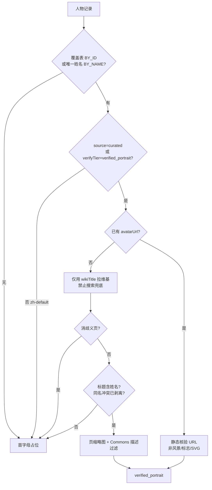

# 人才精英库 · 人物头像核验说明

> 生成日期：2026-07-14  
> 范围：人才模块 `FigureAvatar` / 政要优先队列  
> 原则：**宁可首字母，不可错脸**

---

## 1. 核验如何工作



### 运行时闸门（`canAttemptVerifiedFetch`）

仅当满足其一才允许联网：

1. `verifyTier === 'verified_portrait'` 且具备 `avatarUrl` 或 `wikiTitle`
2. `source === 'curated'` 且具备 `wikiTitle`

履历字段里的 `verifyTier: official/media` **不**授权拉肖像（与核验肖像分层）。

### 失败封闭

| 情形 | 行为 |
|------|------|
| 无覆盖 / 仅 `zh-default` | 首字母，不请求网络 |
| 消歧义页、无缩略图、坏图 URL | 丢弃，首字母 |
| 同 wiki 页映射到两位不同姓名 | 双方覆盖删除 |
| 同名多人（如「李强」） | **禁止**写入 `BY_NAME`；只按 `figureStableId` |
| 随机人脸 API / 未核验爬虫 | **不使用** |

---

## 2. 本批交付

### 解析器修复

- `FigureAvatar` 向 meta 传递 `source`（此前丢失导致 curated 无法触发拉取）
- `figureAvatarProps` 不再把履历 `source/verifyTier` 误当成肖像授权
- 中文 `wikiTitle` 匹配改为**必须包含完整姓名**（去掉仅姓氏模糊）
- 姓名覆盖仅限「全域唯一姓名 + curated/已核验」

### 批处理脚本

`node scripts/resolveVerifiedAvatars.mjs`

- 优先队列：党和国家领导人、副国级、省级正职、中央部长等
- 确定性标题：`姓名` / `姓名 (出生年)` + 强制消歧表（如 `李强 (1959年)`）
- 检查点落盘，可断点续跑
- 产出：`app/src/lib/db/avatarOverrides.js` + `reports/avatar-verify-report.json`

### 已知纠错

- 清华社会学条目 `ce-x-soc01` 曾错误挂 `wikiTitle: 李强`（易成总理错脸）→ 已剥离
- `BY_NAME['李强']` 不再分发，避免市长/教授共用总理肖像

---

## 3. 数量结果（2026-07-14 跑批）

| 指标 | 数值 |
|------|------|
| 政要种子总量 | 1597 |
| 高价值优先队列 | 209 |
| 本批网络尝试 | 201 |
| 核验成功（verified_portrait） | **132** |
| 失败封闭（首字母） | 77 |
| 同页多人冲突剔除 | 0 |
| curated 可拉取（含元数据） | 170 |

样例（已核验）：

- 习近平 → `习近平`
- 李强（总理）→ `李强 (1959年)`（禁止与社会学/市长「李强」共用姓名覆盖）
- 何立峰、尹力、陈吉宁 等中央/省级正职已带 Commons 缩略图 URL

明细见 `reports/avatar-verify-report.json`。

---

## 4. 运维命令

```bash
# 断点续跑（已核验跳过）
node scripts/resolveVerifiedAvatars.mjs --delay 2000

# 构建 / 部署
npm run build
npm run deploy
```

客户端缓存键已升至 `c2os-avatar-cache-v4`，避免旧「未命中」缓存挡住新肖像。

---

## 5. 后续扩展建议

1. 对 `failed` 名单人工补 `TITLE_FORCE` 消歧标题后重跑  
2. 市厅级/常委批量：同样 fail-closed，勿开搜索兜底  
3. 可选：在省级种子行内直接写 `wikiTitle` + `portraitSource: curated`（稳定 id 变更时更可迁移）
